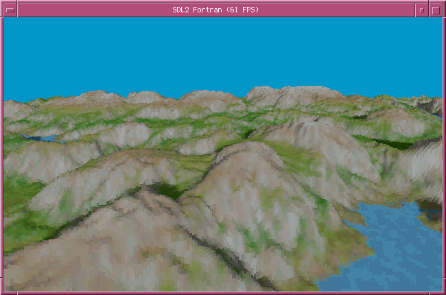

# fortran-sdl2
A collection of ISO C binding interfaces to
[Simple DirectMedia Layer 2.0](https://www.libsdl.org/) (SDL 2.0), for
multimedia and game programming in Fortran. SDL versions tested against:

Library   | Version
----------|--------
SDL       | 2.0.10_1
SDL_image | 2.0.5
SDL_mixer | 2.0.4_2
SDL_ttf   | 2.0.15

The interfaces have been built successfully with GNU Fortran 9, but other modern
compilers should work as well. In most cases, a Fortran 2003 compiler is
sufficient.

Install SDL 2.0, [SDL_image 2.0](https://www.libsdl.org/projects/SDL_image/),
[SDL_mixer 2.0](https://www.libsdl.org/projects/SDL_mixer/), and
[SDL_ttf 2.0](https://www.libsdl.org/projects/SDL_ttf/) with development
headers. On FreeBSD, run:

```
# pkg install devel/sdl20 graphics/sdl2_image audio/sdl2_mixer graphics/sdl2_ttf
```

## Building the Interface Bindings
Clone the repository and then run `make` to build the static library `sdl2.a`:

```
$ git clone https://github.com/interkosmos/fortran-sdl2
$ cd fortran-sdl2/
$ make sdl2
```

You can override the default compiler (`gfortran`) by passing the `FC`
argument, for example:

```
$ make all FC=gfortran9
```

Link your Fortran project with `sdl2.a` or `fortran-sdl2.a`.

### SDL2_image
Build the SDL2_image interfaces with:

```
$ make sdl2_image
```

Link `sdl2_image.a` and add `-lSDL2_image` to your `LDLIBS`.

### SDL2_mixer
Build the SDL2_mixer interfaces with:

```
$ make sdl2_mixer
```

Link `sdl2_mixer.a` and add `-lSDL2_mixer` to your `LDLIBS`.

### SDL2_ttf
Build the SDL2_ttf interfaces with:

```
$ make sdl2_ttf
```

Link `sdl2_ttf.a` and add `-lSDL2_ttf` to your `LDLIBS`.

## Example
An example that shows how to fill a rectangle, using the hardware renderer.

```fortran
! example.f90
program main
    use, intrinsic :: iso_c_binding, only: c_associated, c_int8_t, c_null_char, c_ptr
    use, intrinsic :: iso_fortran_env, only: stdout => output_unit, stderr => error_unit
    use :: sdl2
    implicit none

    integer, parameter :: SCREEN_WIDTH  = 640
    integer, parameter :: SCREEN_HEIGHT = 480

    type(c_ptr)     :: window
    type(c_ptr)     :: renderer
    type(sdl_event) :: event
    type(sdl_rect)  :: rect
    integer         :: rc
    logical         :: is_running = .true.

    ! Initialise SDL.
    if (sdl_init(SDL_INIT_VIDEO) < 0) then
        write (stderr, *) 'SDL Error: ', sdl_get_error()
        stop
    end if

    ! Create the SDL window.
    window = sdl_create_window('Fortran SDL 2.0' // c_null_char, &
                               SDL_WINDOWPOS_UNDEFINED, &
                               SDL_WINDOWPOS_UNDEFINED, &
                               SCREEN_WIDTH, &
                               SCREEN_HEIGHT, &
                               SDL_WINDOW_SHOWN)

    if (.not. c_associated(window)) then
        write (stderr, *) 'SDL Error: ', sdl_get_error()
        stop
    end if

    ! Set position and size of the rectangle.
    rect = sdl_rect(50, 50, 250, 250)

    ! Create the renderer.
    renderer = sdl_create_renderer(window, -1, 0)

    ! Event loop.
    do while (is_running)
        ! Catch events.
        do while (sdl_poll_event(event) > 0)
            select case (event%type)
                case (SDL_QUITEVENT)
                    is_running = .false.
            end select
        end do

        ! Fill screen black.
        rc = sdl_set_render_draw_color(renderer, &
                                       uint8(0), &
                                       uint8(0), &
                                       uint8(0), &
                                       uint8(SDL_ALPHA_OPAQUE))
        rc = sdl_render_clear(renderer)

        ! Fill the rectangle.
        rc = sdl_set_render_draw_color(renderer, &
                                       uint8(127), &
                                       uint8(255), &
                                       uint8(0), &
                                       uint8(SDL_ALPHA_OPAQUE))
        rc = sdl_render_fill_rect(renderer, rect)

        ! Render to screen and wait 20 ms.
        call sdl_render_present(renderer)
        call sdl_delay(20)
    end do

    ! Quit gracefully.
    call sdl_destroy_renderer(renderer)
    call sdl_destroy_window(window)
    call sdl_quit()
end program main
```

Compile the source code with GNU Fortran:

```
$ gfortran `sdl2-config --cflags` -o example example.f90 sdl2.a `sdl2-config --libs`
```

## Further Examples


Some demo applications can be found in `examples/`:

* **alpha** makes one color of an image transparent (software renderer).
* **cyclic** implements a 2D [cyclic cellular automaton](https://en.wikipedia.org/wiki/Cyclic_cellular_automaton) (hardware renderer).
* **draw** draws some shapes (hardware renderer).
* **dvd** loads a PNG file with SDL_image and lets it bounce on the screen (hardware renderer).
* **events** polls SDL events (software renderer).
* **fire** renders the [DOOM fire effect](http://fabiensanglard.net/doom_fire_psx/) (hardware renderer).
* **forest** implements a cellular automaton, based on the [forest fire model](https://rosettacode.org/wiki/Forest_fire) (hardware renderer).
* **image** loads and displays an image (software renderer).
* **info** prints debug information to console (software renderer).
* **msgbox** shows a simple message box (software renderer).
* **opengl** renders primitives with OpenGL 1.3.
* **opera** plays an OGG file with SDL_mixer (software renderer).
* **pixel** copies an SDL_Surface to an SDL_Texture pixelwise (hardware renderer).
* **scaling** displays a scaled image (software renderer).
* **text** outputs text with SDL_ttf (hardware renderer).
* **voxel** renders a [voxel space](https://github.com/s-macke/VoxelSpace) with direct pixel manipulation. Use arrow keys and Q, A for camera movement (hardware renderer).
* **window** opens a window and fills rectangles (software renderer).

Compile all examples with:

```
$ make examples
```

Or, use the name of a particular example.

## Compatibility
All Fortran interface names are written in snake case. For instance,
`SDL_CreateWindow()` can be accessed by Fortran interface `sdl_create_window()`.
The same is valid for derived types and their components. Enums and constants
have kept their original names.

### Null-Termination of Strings
An `c_null_char` must be appended to all strings passed to the SDL 2.0 interface,
except for `sdl_set_hint()`, which is a wrapper function that terminates the
arguments for convenience.

### SDL_Color
SDL 2.0 stores RGB colour values as `Uint8`. As Fortran does not feature unsigned
types, the intrinsic procedure `transfer()` has to be used to transfer bit
patterns directly. For example:

```fortran
type(sdl_color) :: color

color = sdl_color(r = transfer([255, 1], 1_c_int8_t)
                  g = transfer([127, 1], 1_c_int8_t)
                  b = transfer([  0, 1], 1_c_int8_t)
                  a = transfer([SDL_ALPHA_OPAQUE, 1], 1_c_int8_t))
```

The Fortran bindings provide a utility function `uint8()` that simplifies the
conversion:

```fortran
color = sdl_color(r = uint8(255), &
                  g = uint8(127), &
                  b = uint8(0), &
                  a = uint8(SDL_ALPHA_OPAQUE))
```

### SDL_Surface
C pointers in derived types like `sdl_surface` must be converted to Fortran
types manually by calling the intrinsic procedure `c_f_pointer()`. For instance,
to assign the `sdl_pixel_format` pointer in `sdl_surface`:

```fortran
type(sdl_pixel_format), pointer :: pixel_format
type(sdl_surface),      pointer :: surface

! Convert C pointer to Fortran pointer.
call c_f_pointer(surface%format, pixel_format)
```

The utility function `sdl_get_pixel_format()` has been added to the binding to
simplify the conversion from C pointer to Fortran pointer:

```fortran
pixel_format => sdl_get_pixel_format(surface)
```

The C struct `SDL_Surface` stores RGB pixel values as `Uint8`. Use `transfer()`
and `ichar()` to convert `Uint8` to Fortran signed integer. For example:

```fortran
integer, parameter              :: X = 10
integer, parameter              :: Y = 20
integer(kind=2)                 :: r, g, b
integer(kind=c_int32_t)         :: pixel
integer(kind=c_int8_t), pointer :: pixels(:)
type(sdl_pixel_format), pointer :: pixel_format
type(sdl_surface),      pointer :: surface

! Load BMP file into SDL_Surface.
surface => sdl_load_bmp('image.bmp' // c_null_char)

! Get SDL_PixelFormat.
call c_f_pointer(surface%format, pixel_format)

! Get Fortran array of pixel pointers.
call c_f_pointer(surface%pixels, pixels, shape=[surface%pitch * surface%h])

! Get single pixel of coordinates X and Y. Convert to Fortran integer.
pixel = ichar(transfer(pixels((Y - 1) * surface%pitch + X), 'a'), kind=c_int32_t)

! Get RGB values of pixel.
call sdl_get_rgb(pixel, pixel_format, r, g, b)
```

## Coverage
### SDL
| Name                                  | Bound |
|---------------------------------------|-------|
| SDL_AddEventWatch                     |   –   |
| SDL_AddHintCallback                   |   –   |
| SDL_AddTimer                          |   –   |
| SDL_AllocFormat                       |   ✓   |
| SDL_AllocPalette                      |   –   |
| SDL_AllocRW                           |   –   |
| SDL_AndroidGetActivity                |   –   |
| SDL_AndroidGetExternalStoragePath     |   –   |
| SDL_AndroidGetExternalStorageState    |   –   |
| SDL_AndroidGetInternalStoragePath     |   –   |
| SDL_AndroidGetJNIEnv                  |   –   |
| SDL_AtomicAdd                         |   –   |
| SDL_AtomicCAS                         |   –   |
| SDL_AtomicCASPtr                      |   –   |
| SDL_AtomicDecRef                      |   –   |
| SDL_AtomicGet                         |   –   |
| SDL_AtomicGetPtr                      |   –   |
| SDL_AtomicIncRef                      |   –   |
| SDL_AtomicLock                        |   –   |
| SDL_AtomicSet                         |   –   |
| SDL_AtomicSetPtr                      |   –   |
| SDL_AtomicTryLock                     |   –   |
| SDL_AtomicUnlock                      |   –   |
| SDL_AudioInit                         |   –   |
| SDL_AudioQuit                         |   –   |
| SDL_BlitScaled                        |   ✓   |
| SDL_BlitSurface                       |   ✓   |
| SDL_BuildAudioCVT                     |   –   |
| SDL_COMPILEDVERSION                   |   –   |
| SDL_CalculateGammaRamp                |   –   |
| SDL_CaptureMouse                      |   –   |
| SDL_ClearError                        |   –   |
| SDL_ClearHints                        |   –   |
| SDL_ClearQueuedAudio                  |   –   |
| SDL_CloseAudio                        |   –   |
| SDL_CloseAudioDevice                  |   –   |
| SDL_CompilerBarrier                   |   –   |
| SDL_CondBroadcast                     |   –   |
| SDL_CondSignal                        |   –   |
| SDL_CondWait                          |   –   |
| SDL_CondWaitTimeout                   |   –   |
| SDL_ConvertAudio                      |   –   |
| SDL_ConvertPixels                     |   –   |
| SDL_ConvertSurface                    |   ✓   |
| SDL_ConvertSurfaceFormat              |   –   |
| SDL_CreateColorCursor                 |   –   |
| SDL_CreateCond                        |   –   |
| SDL_CreateCursor                      |   –   |
| SDL_CreateMutex                       |   –   |
| SDL_CreateRGBSurface                  |   ✓   |
| SDL_CreateRGBSurfaceFrom              |   –   |
| SDL_CreateRenderer                    |   ✓   |
| SDL_CreateSemaphore                   |   –   |
| SDL_CreateSoftwareRenderer            |   –   |
| SDL_CreateSystemCursor                |   ✓   |
| SDL_CreateTexture                     |   ✓   |
| SDL_CreateTextureFromSurface          |   ✓   |
| SDL_CreateThread                      |   ✓   |
| SDL_CreateWindow                      |   ✓   |
| SDL_CreateWindowAndRenderer           |   –   |
| SDL_CreateWindowFrom                  |   –   |
| SDL_DXGIGetOutputInfo                 |   –   |
| SDL_DelEventWatch                     |   –   |
| SDL_DelHintCallback                   |   –   |
| SDL_Delay                             |   ✓   |
| SDL_DestroyCond                       |   –   |
| SDL_DestroyMutex                      |   –   |
| SDL_DestroyRenderer                   |   ✓   |
| SDL_DestroySemaphore                  |   –   |
| SDL_DestroyTexture                    |   ✓   |
| SDL_DestroyWindow                     |   ✓   |
| SDL_DetachThread                      |   ✓   |
| SDL_Direct3D9GetAdapterIndex          |   –   |
| SDL_DisableScreenSaver                |   –   |
| SDL_EnableScreenSaver                 |   –   |
| SDL_EnclosePoints                     |   –   |
| SDL_EventState                        |   –   |
| SDL_FillRect                          |   ✓   |
| SDL_FillRects                         |   ✓   |
| SDL_FilterEvents                      |   –   |
| SDL_FlushEvent                        |   –   |
| SDL_FlushEvents                       |   –   |
| SDL_FreeCursor                        |   ✓   |
| SDL_FreeFormat                        |   ✓   |
| SDL_FreePalette                       |   –   |
| SDL_FreeRW                            |   –   |
| SDL_FreeSurface                       |   ✓   |
| SDL_FreeWAV                           |   –   |
| SDL_GL_BindTexture                    |   –   |
| SDL_GL_CreateContext                  |   ✓   |
| SDL_GL_DeleteContext                  |   ✓   |
| SDL_GL_ExtensionSupported             |   –   |
| SDL_GL_GetAttribute                   |   –   |
| SDL_GL_GetCurrentContext              |   –   |
| SDL_GL_GetCurrentWindow               |   –   |
| SDL_GL_GetDrawableSize                |   –   |
| SDL_GL_GetProcAddress                 |   –   |
| SDL_GL_GetSwapInterval                |   –   |
| SDL_GL_LoadLibrary                    |   –   |
| SDL_GL_MakeCurrent                    |   –   |
| SDL_GL_ResetAttributes                |   –   |
| SDL_GL_SetAttribute                   |   ✓   |
| SDL_GL_SetSwapInterval                |   –   |
| SDL_GL_SwapWindow                     |   ✓   |
| SDL_GL_UnbindTexture                  |   –   |
| SDL_GL_UnloadLibrary                  |   –   |
| SDL_GameControllerAddMapping          |   –   |
| SDL_GameControllerAddMappingsFromFile |   –   |
| SDL_GameControllerAddMappingsFromRW   |   –   |
| SDL_GameControllerClose               |   –   |
| SDL_GameControllerEventState          |   –   |
| SDL_GameControllerGetAttached         |   –   |
| SDL_GameControllerGetAxis             |   –   |
| SDL_GameControllerGetAxisFromString   |   –   |
| SDL_GameControllerGetBindForAxis      |   –   |
| SDL_GameControllerGetBindForButton    |   –   |
| SDL_GameControllerGetButton           |   –   |
| SDL_GameControllerGetButtonFromString |   –   |
| SDL_GameControllerGetJoystick         |   –   |
| SDL_GameControllerGetStringForAxis    |   –   |
| SDL_GameControllerGetStringForButton  |   –   |
| SDL_GameControllerMapping             |   –   |
| SDL_GameControllerMappingForGUID      |   –   |
| SDL_GameControllerName                |   –   |
| SDL_GameControllerNameForIndex        |   –   |
| SDL_GameControllerOpen                |   –   |
| SDL_GameControllerUpdate              |   –   |
| SDL_GetAssertionHandler               |   –   |
| SDL_GetAssertionReport                |   –   |
| SDL_GetAudioDeviceName                |   –   |
| SDL_GetAudioDeviceStatus              |   –   |
| SDL_GetAudioDriver                    |   ✓   |
| SDL_GetAudioStatus                    |   –   |
| SDL_GetBasePath                       |   ✓   |
| SDL_GetCPUCacheLineSize               |   ✓   |
| SDL_GetCPUCount                       |   ✓   |
| SDL_GetClipRect                       |   –   |
| SDL_GetClipboardText                  |   –   |
| SDL_GetClosestDisplayMode             |   –   |
| SDL_GetColorKey                       |   –   |
| SDL_GetCurrentAudioDriver             |   ✓   |
| SDL_GetCurrentDisplayMode             |   –   |
| SDL_GetCurrentVideoDriver             |   ✓   |
| SDL_GetCursor                         |   –   |
| SDL_GetDefaultAssertionHandler        |   –   |
| SDL_GetDefaultCursor                  |   ✓   |
| SDL_GetDesktopDisplayMode             |   –   |
| SDL_GetDisplayBounds                  |   –   |
| SDL_GetDisplayMode                    |   –   |
| SDL_GetDisplayName                    |   –   |
| SDL_GetError                          |   ✓   |
| SDL_GetEventFilter                    |   –   |
| SDL_GetGlobalMouseState               |   –   |
| SDL_GetHint                           |   ✓   |
| SDL_GetKeyFromName                    |   –   |
| SDL_GetKeyFromScancode                |   –   |
| SDL_GetKeyName                        |   –   |
| SDL_GetKeyboardFocus                  |   –   |
| SDL_GetKeyboardState                  |   ✓   |
| SDL_GetModState                       |   –   |
| SDL_GetMouseFocus                     |   –   |
| SDL_GetMouseState                     |   ✓   |
| SDL_GetNumAudioDevices                |   ✓   |
| SDL_GetNumAudioDrivers                |   –   |
| SDL_GetNumDisplayModes                |   –   |
| SDL_GetNumRenderDrivers               |   ✓   |
| SDL_GetNumTouchDevices                |   –   |
| SDL_GetNumTouchFingers                |   –   |
| SDL_GetNumVideoDisplays               |   –   |
| SDL_GetNumVideoDrivers                |   –   |
| SDL_GetPerformanceCounter             |   ✓   |
| SDL_GetPerformanceFrequency           |   ✓   |
| SDL_GetPixelFormatName                |   –   |
| SDL_GetPlatform                       |   ✓   |
| SDL_GetPowerInfo                      |   –   |
| SDL_GetPrefPath                       |   –   |
| SDL_GetQueuedAudioSize                |   –   |
| SDL_GetRGB                            |   ✓   |
| SDL_GetRGBA                           |   ✓   |
| SDL_GetRelativeMouseMode              |   –   |
| SDL_GetRelativeMouseState             |   –   |
| SDL_GetRenderDrawBlendMode            |   –   |
| SDL_GetRenderDrawColor                |   –   |
| SDL_GetRenderDriverInfo               |   ✓   |
| SDL_GetRenderTarget                   |   ✓   |
| SDL_GetRenderer                       |   –   |
| SDL_GetRendererInfo                   |   –   |
| SDL_GetRendererOutputSize             |   –   |
| SDL_GetRevision                       |   –   |
| SDL_GetRevisionNumber                 |   –   |
| SDL_GetScancodeFromKey                |   –   |
| SDL_GetScancodeFromName               |   –   |
| SDL_GetScancodeName                   |   –   |
| SDL_GetSurfaceAlphaMod                |   –   |
| SDL_GetSurfaceBlendMode               |   –   |
| SDL_GetSurfaceColorMod                |   –   |
| SDL_GetSystemRAM                      |   ✓   |
| SDL_GetTextureAlphaMod                |   –   |
| SDL_GetTextureBlendMode               |   –   |
| SDL_GetTextureColorMod                |   –   |
| SDL_GetThreadID                       |   –   |
| SDL_GetThreadName                     |   –   |
| SDL_GetTicks                          |   ✓   |
| SDL_GetTouchDevice                    |   –   |
| SDL_GetTouchFinger                    |   –   |
| SDL_GetVersion                        |   ✓   |
| SDL_GetVideoDriver                    |   ✓   |
| SDL_GetWindowBrightness               |   –   |
| SDL_GetWindowData                     |   –   |
| SDL_GetWindowDisplayIndex             |   –   |
| SDL_GetWindowDisplayMode              |   –   |
| SDL_GetWindowFlags                    |   –   |
| SDL_GetWindowFromID                   |   –   |
| SDL_GetWindowGammaRamp                |   –   |
| SDL_GetWindowGrab                     |   –   |
| SDL_GetWindowID                       |   ✓   |
| SDL_GetWindowMaximumSize              |   ✓   |
| SDL_GetWindowMinimumSize              |   ✓   |
| SDL_GetWindowPixelFormat              |   –   |
| SDL_GetWindowPosition                 |   ✓   |
| SDL_GetWindowSize                     |   ✓   |
| SDL_GetWindowSurface                  |   ✓   |
| SDL_GetWindowTitle                    |   ✓   |
| SDL_GetWindowWMInfo                   |   –   |
| SDL_HapticClose                       |   –   |
| SDL_HapticDestroyEffect               |   –   |
| SDL_HapticEffectSupported             |   –   |
| SDL_HapticGetEffectStatus             |   –   |
| SDL_HapticIndex                       |   –   |
| SDL_HapticName                        |   –   |
| SDL_HapticNewEffect                   |   –   |
| SDL_HapticNumAxes                     |   –   |
| SDL_HapticNumEffects                  |   –   |
| SDL_HapticNumEffectsPlaying           |   –   |
| SDL_HapticOpen                        |   –   |
| SDL_HapticOpenFromJoystick            |   –   |
| SDL_HapticOpenFromMouse               |   –   |
| SDL_HapticOpened                      |   –   |
| SDL_HapticPause                       |   –   |
| SDL_HapticQuery                       |   –   |
| SDL_HapticRumbleInit                  |   –   |
| SDL_HapticRumblePlay                  |   –   |
| SDL_HapticRumbleStop                  |   –   |
| SDL_HapticRumbleSupported             |   –   |
| SDL_HapticRunEffect                   |   –   |
| SDL_HapticSetAutocenter               |   –   |
| SDL_HapticSetGain                     |   –   |
| SDL_HapticStopAll                     |   –   |
| SDL_HapticStopEffect                  |   –   |
| SDL_HapticUnpause                     |   –   |
| SDL_HapticUpdateEffect                |   –   |
| SDL_Has3DNow                          |   ✓   |
| SDL_HasAVX                            |   ✓   |
| SDL_HasAVX2                           |   ✓   |
| SDL_HasAltiVec                        |   ✓   |
| SDL_HasClipboardText                  |   –   |
| SDL_HasEvent                          |   –   |
| SDL_HasEvents                         |   –   |
| SDL_HasIntersection                   |   –   |
| SDL_HasMMX                            |   ✓   |
| SDL_HasRDTSC                          |   ✓   |
| SDL_HasSSE                            |   ✓   |
| SDL_HasSSE2                           |   ✓   |
| SDL_HasSSE3                           |   ✓   |
| SDL_HasSSE41                          |   ✓   |
| SDL_HasSSE42                          |   ✓   |
| SDL_HasScreenKeyboardSupport          |   –   |
| SDL_HideWindow                        |   ✓   |
| SDL_Init                              |   ✓   |
| SDL_InitSubSystem                     |   –   |
| SDL_IntersectRect                     |   –   |
| SDL_IntersectRectAndLine              |   –   |
| SDL_IsGameController                  |   –   |
| SDL_IsScreenKeyboardShown             |   –   |
| SDL_IsScreenSaverEnabled              |   –   |
| SDL_IsTextInputActive                 |   –   |
| SDL_JoystickClose                     |   –   |
| SDL_JoystickEventState                |   –   |
| SDL_JoystickFromInstanceID            |   –   |
| SDL_JoystickGetAttached               |   –   |
| SDL_JoystickGetAxis                   |   –   |
| SDL_JoystickGetBall                   |   –   |
| SDL_JoystickGetButton                 |   –   |
| SDL_JoystickGetDeviceGUID             |   –   |
| SDL_JoystickGetGUID                   |   –   |
| SDL_JoystickGetGUIDFromString         |   –   |
| SDL_JoystickGetGUIDString             |   –   |
| SDL_JoystickGetHat                    |   –   |
| SDL_JoystickInstanceID                |   –   |
| SDL_JoystickIsHaptic                  |   –   |
| SDL_JoystickName                      |   –   |
| SDL_JoystickNameForIndex              |   –   |
| SDL_JoystickNumAxes                   |   –   |
| SDL_JoystickNumBalls                  |   –   |
| SDL_JoystickNumButtons                |   –   |
| SDL_JoystickNumHats                   |   –   |
| SDL_JoystickOpen                      |   –   |
| SDL_JoystickUpdate                    |   –   |
| SDL_LoadBMP                           |   ✓   |
| SDL_LoadBMP_RW                        |   ✓   |
| SDL_LoadDollarTemplates               |   –   |
| SDL_LoadFunction                      |   –   |
| SDL_LoadObject                        |   –   |
| SDL_LoadWAV                           |   –   |
| SDL_LoadWAV_RW                        |   –   |
| SDL_LockAudio                         |   –   |
| SDL_LockAudioDevice                   |   –   |
| SDL_LockMutex                         |   –   |
| SDL_LockSurface                       |   –   |
| SDL_LockTexture                       |   ✓   |
| SDL_Log                               |   –   |
| SDL_LogCritical                       |   –   |
| SDL_LogDebug                          |   –   |
| SDL_LogError                          |   –   |
| SDL_LogGetOutputFunction              |   ✓   |
| SDL_LogGetPriority                    |   ✓   |
| SDL_LogInfo                           |   –   |
| SDL_LogMessage                        |   –   |
| SDL_LogMessageV                       |   –   |
| SDL_LogResetPriorities                |   ✓   |
| SDL_LogSetAllPriority                 |   ✓   |
| SDL_LogSetOutputFunction              |   ✓   |
| SDL_LogSetPriority                    |   ✓   |
| SDL_LogVerbose                        |   –   |
| SDL_LogWarn                           |   –   |
| SDL_LowerBlit                         |   –   |
| SDL_LowerBlitScaled                   |   –   |
| SDL_MUSTLOCK                          |   –   |
| SDL_MapRGB                            |   ✓   |
| SDL_MapRGBA                           |   ✓   |
| SDL_MasksToPixelFormatEnum            |   –   |
| SDL_MaximizeWindow                    |   ✓   |
| SDL_MinimizeWindow                    |   ✓   |
| SDL_MixAudio                          |   –   |
| SDL_MixAudioFormat                    |   –   |
| SDL_MostSignificantBitIndex32         |   –   |
| SDL_MouseIsHaptic                     |   –   |
| SDL_NumHaptics                        |   –   |
| SDL_NumJoysticks                      |   –   |
| SDL_OpenAudio                         |   –   |
| SDL_OpenAudioDevice                   |   –   |
| SDL_PauseAudio                        |   –   |
| SDL_PauseAudioDevice                  |   –   |
| SDL_PeepEvents                        |   –   |
| SDL_PixelFormatEnumToMasks            |   –   |
| SDL_PointInRect                       |   –   |
| SDL_PollEvent                         |   ✓   |
| SDL_PumpEvents                        |   ✓   |
| SDL_PushEvent                         |   –   |
| SDL_QueryTexture                      |   ✓   |
| SDL_QueueAudio                        |   –   |
| SDL_Quit                              |   ✓   |
| SDL_QuitRequested                     |   –   |
| SDL_QuitSubSystem                     |   –   |
| SDL_REVISION                          |   –   |
| SDL_RWFromConstMem                    |   ✓   |
| SDL_RWFromFP                          |   –   |
| SDL_RWFromFile                        |   ✓   |
| SDL_RWFromMem                         |   ✓   |
| SDL_RWclose                           |   –   |
| SDL_RWread                            |   –   |
| SDL_RWseek                            |   –   |
| SDL_RWsize                            |   –   |
| SDL_RWtell                            |   –   |
| SDL_RWwrite                           |   –   |
| SDL_RaiseWindow                       |   ✓   |
| SDL_ReadBE16                          |   –   |
| SDL_ReadBE32                          |   –   |
| SDL_ReadBE64                          |   –   |
| SDL_ReadLE16                          |   –   |
| SDL_ReadLE32                          |   –   |
| SDL_ReadLE64                          |   –   |
| SDL_ReadU8                            |   –   |
| SDL_RecordGesture                     |   –   |
| SDL_RectEmpty                         |   –   |
| SDL_RectEquals                        |   –   |
| SDL_RegisterEvents                    |   –   |
| SDL_RemoveTimer                       |   –   |
| SDL_RenderClear                       |   ✓   |
| SDL_RenderCopy                        |   ✓   |
| SDL_RenderCopyEx                      |   ✓   |
| SDL_RenderDrawLine                    |   ✓   |
| SDL_RenderDrawLines                   |   ✓   |
| SDL_RenderDrawPoint                   |   ✓   |
| SDL_RenderDrawPoints                  |   ✓   |
| SDL_RenderDrawRect                    |   ✓   |
| SDL_RenderDrawRects                   |   ✓   |
| SDL_RenderFillRect                    |   ✓   |
| SDL_RenderFillRects                   |   ✓   |
| SDL_RenderGetClipRect                 |   –   |
| SDL_RenderGetD3D9Device               |   –   |
| SDL_RenderGetLogicalSize              |   –   |
| SDL_RenderGetScale                    |   ✓   |
| SDL_RenderGetViewport                 |   ✓   |
| SDL_RenderIsClipEnabled               |   –   |
| SDL_RenderPresent                     |   ✓   |
| SDL_RenderReadPixels                  |   ✓   |
| SDL_RenderSetClipRect                 |   –   |
| SDL_RenderSetLogicalSize              |   –   |
| SDL_RenderSetScale                    |   ✓   |
| SDL_RenderSetViewport                 |   ✓   |
| SDL_RenderTargetSupported             |   –   |
| SDL_ResetAssertionReport              |   –   |
| SDL_RestoreWindow                     |   ✓   |
| SDL_SaveAllDollarTemplates            |   –   |
| SDL_SaveBMP                           |   ✓   |
| SDL_SaveBMP_RW                        |   ✓   |
| SDL_SaveDollarTemplate                |   –   |
| SDL_SemPost                           |   –   |
| SDL_SemTryWait                        |   –   |
| SDL_SemValue                          |   –   |
| SDL_SemWait                           |   –   |
| SDL_SemWaitTimeout                    |   –   |
| SDL_SetAssertionHandler               |   –   |
| SDL_SetClipRect                       |   –   |
| SDL_SetClipboardText                  |   –   |
| SDL_SetColorKey                       |   ✓   |
| SDL_SetCursor                         |   ✓   |
| SDL_SetError                          |   –   |
| SDL_SetEventFilter                    |   –   |
| SDL_SetHint                           |   ✓   |
| SDL_SetHintWithPriority               |   –   |
| SDL_SetMainReady                      |   –   |
| SDL_SetModState                       |   –   |
| SDL_SetPaletteColors                  |   –   |
| SDL_SetPixelFormatPalette             |   –   |
| SDL_SetRelativeMouseMode              |   ✓   |
| SDL_SetRenderDrawBlendMode            |   ✓   |
| SDL_SetRenderDrawColor                |   ✓   |
| SDL_SetRenderTarget                   |   ✓   |
| SDL_SetSurfaceAlphaMod                |   –   |
| SDL_SetSurfaceBlendMode               |   –   |
| SDL_SetSurfaceColorMod                |   –   |
| SDL_SetSurfacePalette                 |   –   |
| SDL_SetSurfaceRLE                     |   –   |
| SDL_SetTextInputRect                  |   –   |
| SDL_SetTextureAlphaMod                |   –   |
| SDL_SetTextureBlendMode               |   –   |
| SDL_SetTextureColorMod                |   ✓   |
| SDL_SetThreadPriority                 |   –   |
| SDL_SetWindowBordered                 |   ✓   |
| SDL_SetWindowBrightness               |   –   |
| SDL_SetWindowData                     |   –   |
| SDL_SetWindowDisplayMode              |   –   |
| SDL_SetWindowFullscreen               |   ✓   |
| SDL_SetWindowGammaRamp                |   –   |
| SDL_SetWindowGrab                     |   –   |
| SDL_SetWindowHitTest                  |   –   |
| SDL_SetWindowIcon                     |   ✓   |
| SDL_SetWindowMaximumSize              |   ✓   |
| SDL_SetWindowMinimumSize              |   ✓   |
| SDL_SetWindowPosition                 |   ✓   |
| SDL_SetWindowResizable                |   ✓   |
| SDL_SetWindowSize                     |   ✓   |
| SDL_SetWindowTitle                    |   ✓   |
| SDL_ShowCursor                        |   ✓   |
| SDL_ShowMessageBox                    |   –   |
| SDL_ShowSimpleMessageBox              |   ✓   |
| SDL_ShowWindow                        |   ✓   |
| SDL_StartTextInput                    |   –   |
| SDL_StopTextInput                     |   –   |
| SDL_Swap16                            |   –   |
| SDL_Swap32                            |   –   |
| SDL_Swap64                            |   –   |
| SDL_SwapBE16                          |   –   |
| SDL_SwapBE32                          |   –   |
| SDL_SwapBE64                          |   –   |
| SDL_SwapFloat                         |   –   |
| SDL_SwapFloatBE                       |   –   |
| SDL_SwapFloatLE                       |   –   |
| SDL_SwapLE16                          |   –   |
| SDL_SwapLE32                          |   –   |
| SDL_SwapLE64                          |   –   |
| SDL_TICKS_PASSED                      |   –   |
| SDL_TLSCreate                         |   –   |
| SDL_TLSGet                            |   –   |
| SDL_TLSSet                            |   –   |
| SDL_ThreadID                          |   –   |
| SDL_TriggerBreakpoint                 |   –   |
| SDL_TryLockMutex                      |   –   |
| SDL_UnionRect                         |   –   |
| SDL_UnloadObject                      |   –   |
| SDL_UnlockAudio                       |   –   |
| SDL_UnlockAudioDevice                 |   –   |
| SDL_UnlockMutex                       |   –   |
| SDL_UnlockSurface                     |   –   |
| SDL_UnlockTexture                     |   ✓   |
| SDL_UpdateTexture                     |   ✓   |
| SDL_UpdateWindowSurface               |   ✓   |
| SDL_UpdateWindowSurfaceRects          |   –   |
| SDL_UpdateYUVTexture                  |   –   |
| SDL_UpperBlit                         |   ✓   |
| SDL_UpperBlitScaled                   |   ✓   |
| SDL_VERSION                           |   –   |
| SDL_VERSIONNUM                        |   –   |
| SDL_VERSION_ATLEAST                   |   –   |
| SDL_VideoInit                         |   –   |
| SDL_VideoQuit                         |   –   |
| SDL_WaitEvent                         |   ✓   |
| SDL_WaitEventTimeout                  |   –   |
| SDL_WaitThread                        |   ✓   |
| SDL_WarpMouseGlobal                   |   ✓   |
| SDL_WarpMouseInWindow                 |   ✓   |
| SDL_WasInit                           |   –   |
| SDL_WinRTGetFSPathUNICODE             |   –   |
| SDL_WinRTGetFSPathUTF8                |   –   |
| SDL_WinRTRunApp                       |   –   |
| SDL_WriteBE16                         |   –   |
| SDL_WriteBE32                         |   –   |
| SDL_WriteBE64                         |   –   |
| SDL_WriteLE16                         |   –   |
| SDL_WriteLE32                         |   –   |
| SDL_WriteLE64                         |   –   |
| SDL_acos                              |   –   |
| SDL_assert                            |   –   |
| SDL_assert_paranoid                   |   –   |
| SDL_assert_release                    |   –   |

### SDL_image
| Name                                  | Bound |
|---------------------------------------|-------|
| IMG_GetError                          |   –   |
| IMG_Init                              |   ✓   |
| IMG_Linked_Version                    |   –   |
| IMG_Load                              |   ✓   |
| IMG_LoadBMP_RW                        |   –   |
| IMG_LoadCUR_RW                        |   –   |
| IMG_LoadGIF_RW                        |   –   |
| IMG_LoadICO_RW                        |   –   |
| IMG_LoadJPG_RW                        |   –   |
| IMG_LoadLBM_RW                        |   –   |
| IMG_LoadPCX_RW                        |   –   |
| IMG_LoadPNG_RW                        |   –   |
| IMG_LoadPNM_RW                        |   –   |
| IMG_LoadTGA_RW                        |   –   |
| IMG_LoadTIF_RW                        |   –   |
| IMG_LoadTexture                       |   ✓   |
| IMG_LoadTextureTyped_RW               |   –   |
| IMG_LoadTexture_RW                    |   –   |
| IMG_LoadTyped_RW                      |   –   |
| IMG_LoadXCF_RW                        |   –   |
| IMG_LoadXPM_RW                        |   –   |
| IMG_LoadXV_RW                         |   –   |
| IMG_Load_RW                           |   –   |
| IMG_Quit                              |   ✓   |
| IMG_ReadXPMFromArray                  |   –   |
| IMG_SavePNG                           |   –   |
| IMG_SavePNG_RW                        |   –   |
| IMG_SetError                          |   –   |
| IMG_isBMP                             |   –   |
| IMG_isCUR                             |   –   |
| IMG_isGIF                             |   –   |
| IMG_isICO                             |   –   |
| IMG_isJPG                             |   –   |
| IMG_isLBM                             |   –   |
| IMG_isPCX                             |   –   |
| IMG_isPNG                             |   –   |
| IMG_isPNM                             |   –   |
| IMG_isTIF                             |   –   |
| IMG_isXCF                             |   –   |
| IMG_isXPM                             |   –   |
| IMG_isXV                              |   –   |

### SDL_mixer
| Name                                  | Bound |
|---------------------------------------|-------|
| Mix_AllocateChannels                  |   ✓   |
| Mix_ChannelFinished                   |   –   |
| Mix_CloseAudio                        |   ✓   |
| Mix_ExpireChannel                     |   –   |
| Mix_FadeInChannel                     |   –   |
| Mix_FadeInChannelTimed                |   –   |
| Mix_FadeInMusic                       |   –   |
| Mix_FadeInMusicPos                    |   –   |
| Mix_FadeOutChannel                    |   –   |
| Mix_FadeOutGroup                      |   –   |
| Mix_FadeOutMusic                      |   –   |
| Mix_FadingChannel                     |   –   |
| Mix_FadingMusic                       |   –   |
| Mix_FreeChunk                         |   ✓   |
| Mix_FreeMusic                         |   ✓   |
| Mix_GetChunk                          |   –   |
| Mix_GetChunkDecoder                   |   –   |
| Mix_GetError                          |   –   |
| Mix_GetMusicDecoder                   |   –   |
| Mix_GetMusicHookData                  |   –   |
| Mix_GetMusicType                      |   –   |
| Mix_GetNumChunkDecoders               |   –   |
| Mix_GetNumMusicDecoders               |   –   |
| Mix_GroupAvailable                    |   –   |
| Mix_GroupChannel                      |   –   |
| Mix_GroupChannels                     |   –   |
| Mix_GroupCount                        |   –   |
| Mix_GroupNewer                        |   –   |
| Mix_GroupOldest                       |   –   |
| Mix_HaltChannel                       |   –   |
| Mix_HaltGroup                         |   –   |
| Mix_HaltMusic                         |   –   |
| Mix_HookMusic                         |   –   |
| Mix_HookMusicFinished                 |   –   |
| Mix_Init                              |   –   |
| Mix_Linked_Version                    |   –   |
| Mix_LoadMUS                           |   ✓   |
| Mix_LoadWAV                           |   ✓   |
| Mix_LoadWAV_RW                        |   ✓   |
| Mix_OpenAudio                         |   ✓   |
| Mix_Pause                             |   –   |
| Mix_PauseMusic                        |   –   |
| Mix_Paused                            |   –   |
| Mix_PausedMusic                       |   –   |
| Mix_PlayChannel                       |   ✓   |
| Mix_PlayChannelTimed                  |   ✓   |
| Mix_PlayMusic                         |   ✓   |
| Mix_Playing                           |   ✓   |
| Mix_PlayingMusic                      |   ✓   |
| Mix_QuerySpec                         |   –   |
| Mix_QuickLoad_RAW                     |   –   |
| Mix_QuickLoad_WAV                     |   –   |
| Mix_Quit                              |   ✓   |
| Mix_RegisterEffect                    |   –   |
| Mix_ReserveChannels                   |   –   |
| Mix_Resume                            |   –   |
| Mix_ResumeMusic                       |   –   |
| Mix_RewindMusic                       |   –   |
| Mix_SetDistance                       |   –   |
| Mix_SetError                          |   –   |
| Mix_SetMusicCMD                       |   –   |
| Mix_SetMusicPosition                  |   –   |
| Mix_SetPanning                        |   –   |
| Mix_SetPosition                       |   –   |
| Mix_SetPostMix                        |   –   |
| Mix_SetReverseStereo                  |   –   |
| Mix_UnregisterAllEffects              |   –   |
| Mix_UnregisterEffect                  |   –   |
| Mix_Volume                            |   –   |
| Mix_VolumeChunk                       |   ✓   |
| Mix_VolumeMusic                       |   ✓   |

### SDL_ttf
| Name                                  | Bound |
|---------------------------------------|-------|
| SDL_TTF_MAJOR_VERSION                 |   –   |
| SDL_TTF_MINOR_VERSION                 |   –   |
| SDL_TTF_PATCHLEVEL                    |   –   |
| TTF_ByteSwappedUNICODE                |   –   |
| TTF_CloseFont                         |   ✓   |
| TTF_FontAscent                        |   –   |
| TTF_FontDescent                       |   –   |
| TTF_FontFaceFamilyName                |   –   |
| TTF_FontFaceIsFixedWidth              |   –   |
| TTF_FontFaceStyleName                 |   –   |
| TTF_FontFaces                         |   –   |
| TTF_FontHeight                        |   –   |
| TTF_FontLineSkip                      |   –   |
| TTF_GetError                          |   –   |
| TTF_GetFontHinting                    |   –   |
| TTF_GetFontKerning                    |   –   |
| TTF_GetFontOutline                    |   –   |
| TTF_GetFontStyle                      |   –   |
| TTF_GlyphIsProvided                   |   –   |
| TTF_GlyphMetrics                      |   –   |
| TTF_Init                              |   ✓   |
| TTF_Linked_Version                    |   –   |
| TTF_OpenFont                          |   ✓   |
| TTF_OpenFontIndex                     |   –   |
| TTF_OpenFontIndexRW                   |   –   |
| TTF_OpenFontRW                        |   –   |
| TTF_Quit                              |   ✓   |
| TTF_RenderGlyph_Blended               |   –   |
| TTF_RenderGlyph_Shaded                |   –   |
| TTF_RenderGlyph_Solid                 |   –   |
| TTF_RenderText_Blended                |   –   |
| TTF_RenderText_Shaded                 |   ✓   |
| TTF_RenderText_Solid                  |   ✓   |
| TTF_RenderUNICODE_Blended             |   –   |
| TTF_RenderUNICODE_Shaded              |   –   |
| TTF_RenderUNICODE_Solid               |   –   |
| TTF_RenderUTF8_Blended                |   –   |
| TTF_RenderUTF8_Shaded                 |   –   |
| TTF_RenderUTF8_Solid                  |   –   |
| TTF_SetError                          |   –   |
| TTF_SetFontHinting                    |   –   |
| TTF_SetFontKerning                    |   –   |
| TTF_SetFontOutline                    |   –   |
| TTF_SetFontStyle                      |   –   |
| TTF_SizeText                          |   –   |
| TTF_SizeUNICODE                       |   –   |
| TTF_SizeUTF8                          |   –   |
| TTF_WasInit                           |   –   |

## Utility Functions
| Name                                  | Description                                     |
|---------------------------------------|-------------------------------------------------|
| sdl_get_pixel_format                  | Returns `SDL_PixelFormat` pointer of a surface. |
| uint8                                 | Converts Fortran signed integer to `Uint8`.     |

## Credits
Thanks go to [angelog0](https://github.com/angelog0).

## Licence
ISC
